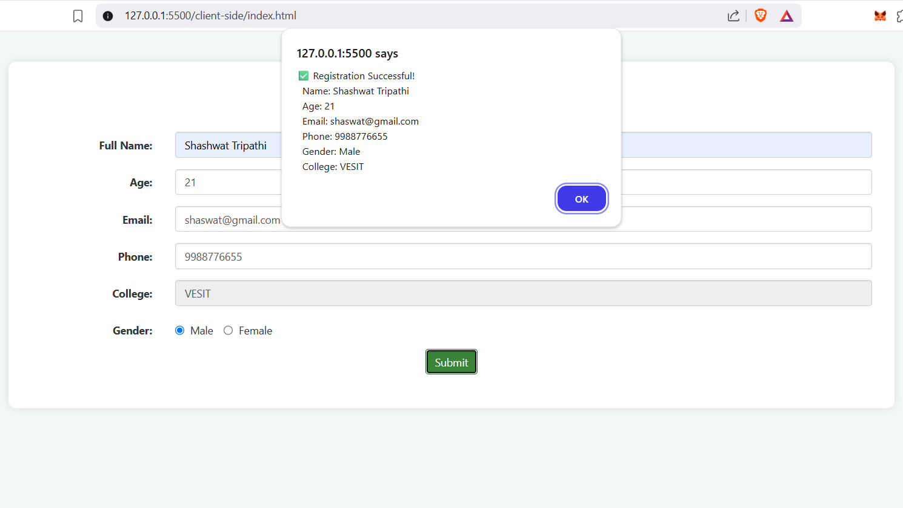

# 🎓 Student Registration Form – Client Side Programming

A complete HTML/CSS/JavaScript project demonstrating form creation, styling, and client-side validation using modern best practices. This project is built as part of the Client Side Programming module.

---

## 📁 Project Structure

.client-side  
├── index.html      # Main HTML form  
├── style.css       # Custom styles  
└── script.js       # JavaScript for form validation

---

## 🚀 Features Covered

Feature                         | Description  
-------------------------------|-------------------------------------------------------------  
✅ HTML5 Inputs & Attributes     | Used appropriate input types like email, number, tel  
✅ Bootstrap Styling             | Responsive layout using Bootstrap 3  
✅ Custom CSS                   | Clean UI with shadows and padding  
✅ JavaScript Form Validation   | Regex-based checks for name, email, phone, and age  
✅ Gender Selection              | Ensures one of the radio buttons is selected  
✅ Readonly Field                | College field pre-filled as VESIT

---

## 🧱 Components Explained

### 🔹 index.html

This is the core structure of the form, containing:

- Text Input for Full Name  
- Number Input for Age  
- Email Input for email with HTML5 validation  
- Telephone Input for phone number  
- Radio Buttons for Gender selection  
- Readonly Input for College (pre-filled as VESIT)  
- Bootstrap Classes for layout and responsiveness  

Bootstrap CDN is used for quick styling without installing dependencies.

---

### 🔹 style.css

Adds custom styling on top of Bootstrap to:

- Add spacing and padding  
- Apply box-shadow and border-radius  
- Maintain clean layout and user-friendly appearance

---

### 🔹 script.js

Handles advanced JavaScript (ES6) validation logic before the form submits:

- Name: Allows only alphabets and spaces (3–50 chars)  
- Age: Between 17 and 30  
- Email: Must match standard email regex  
- Phone: Must be a valid 10-digit Indian mobile number starting with 6–9  
- Gender: Ensures at least one option is selected  

On successful validation, an alert displays the submitted values.

---

## 🧪 Sample Output

✅ Registration Successful!  
Name: Shashwat Tripathi  
Age: 21  
Email: shaswat@gmail.com  
Phone: 9988776655  
Gender: Male  
College: VESIT

---

## 📦 Technologies Used

- HTML5  
- CSS3  
- Bootstrap 3.3.7  
- JavaScript (ES6)

---

## 📌 How to Run

1. Download the files.  
2. Open index.html in any modern web browser.  
3. Fill the form and hit Submit.  
4. Validate form behavior by trying different inputs.

---

## Output

---

## 📚 References

- MDN Web Docs – HTML5: https://developer.mozilla.org/en-US/docs/Web/Guide/HTML/HTML5  
- W3Schools CSS: https://www.w3schools.com/Css/  
- Bootstrap 3 Docs: https://getbootstrap.com/docs/3.3/  
- JavaScript (ES6): https://www.tutorialspoint.com/es6/index.htm
